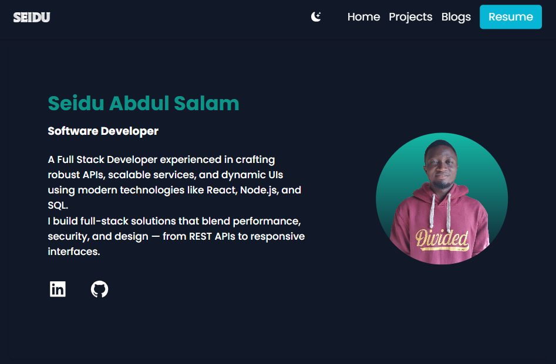
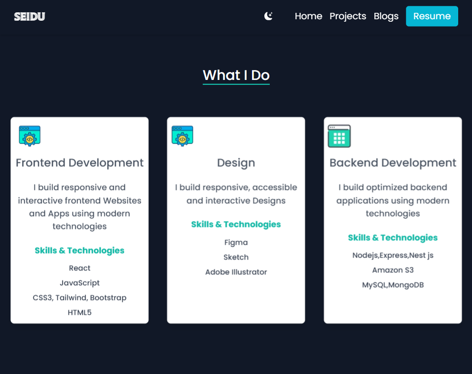
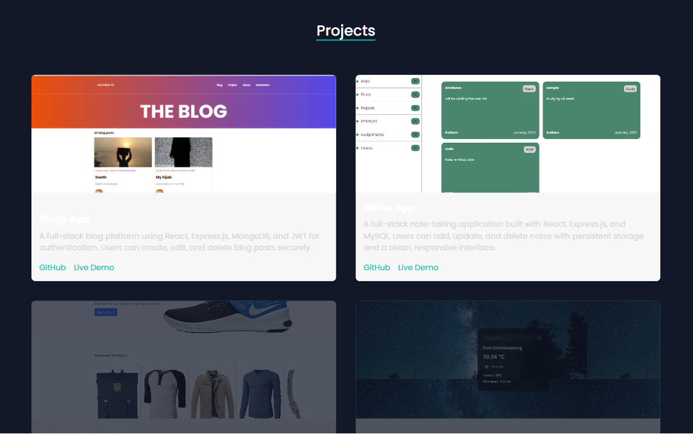
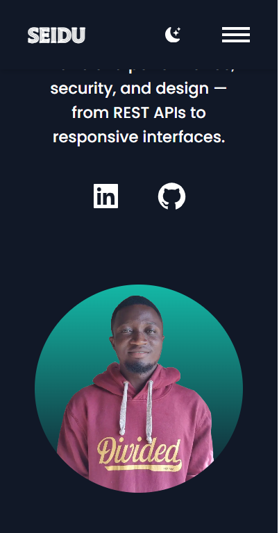

## MY PERSONAL_SITE

Welcome to the source code of my personal portfolio website!  
Built using [Next.js](https://nextjs.org/) and [Tailwind CSS](https://tailwindcss.com/), this project showcases my work, skills, and background as a developer.

## 🚀 Tech Stack

- **Framework**: [Next.js](https://nextjs.org/)
- **Styling**: [Tailwind CSS](https://tailwindcss.com/)

## 📸 Features

- ⚡ Blazing fast performance with static site generation
- 🎨 Clean, responsive, and modern UI with Tailwind CSS
- 💼 Dynamic portfolio/projects section
- 📱 Fully responsive across devices
- 🌙 Dark mode support
- 📩 Contact form

## SCREENSHOT

